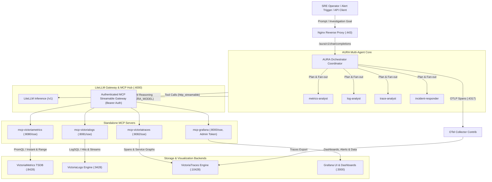

# Mezmo AURA AI SRE Agent Guide & Use Cases

[](https://github.com/mezmo/aura)
[](https://litellm.ai/)
[](https://modelcontextprotocol.io/)
[](https://victoriametrics.com/)
[](https://grafana.com/)

**Mezmo AURA** is an autonomous multi-agent Site Reliability Engineering (SRE) AI agent designed for incident investigation, telemetry querying, and root-cause analysis. In `o11ystack`, AURA connects to the **VictoriaMetrics Observability Trio** (metrics, logs, traces) and **Grafana** through an authenticated **Model Context Protocol (MCP)** gateway managed by **LiteLLM**.

---

## Table of Contents

- [Architecture & Multi-Agent Flow](#architecture--multi-agent-flow)
- [How to Access and Interact with AURA](#how-to-access-and-interact-with-aura)
  - [Method 1: Interactive Terminal Client (REPL & One-Shot)](#method-1-interactive-terminal-client-repl--one-shot)
  - [Method 2: OpenAI-Compatible REST API (curl & Python SDK)](#method-2-openai-compatible-rest-api-curl--python-sdk)
  - [Method 3: Web Landing Portal](#method-3-web-landing-portal)
- [Observing AURA's AI Reasoning Traces in Grafana](#observing-auras-ai-reasoning-traces-in-grafana)
- [Real-World SRE Use Cases](#real-world-sre-use-cases)
  - [Use Case 1: CPU & Memory Anomaly Detection](#use-case-1-cpu--memory-anomaly-detection)
  - [Use Case 2: Log Triage & Root-Cause Pattern Analysis](#use-case-2-log-triage--root-cause-pattern-analysis)
  - [Use Case 3: Distributed Tracing & Bottleneck Latency Discovery](#use-case-3-distributed-tracing--bottleneck-latency-discovery)
  - [Use Case 4: Grafana Alerting & Dashboard Health Validation](#use-case-4-grafana-alerting--dashboard-health-validation)
  - [Use Case 5: Full Cross-Domain Observability Audit](#use-case-5-full-cross-domain-observability-audit)
  - [Use Case 6: Automated CI/CD Release Health Gate](#use-case-6-automated-cicd-release-health-gate)
- [Configuring Models for AURA](#configuring-models-for-aura)
- [Troubleshooting & Diagnostics](#troubleshooting--diagnostics)

---

## Architecture & Multi-Agent Flow

AURA operates with an **Orchestrator Coordinator** that plans multi-turn investigations and delegates tasks to domain-specialist workers with access to **216 live MCP tools**:



### Specialist Worker Roles:
1. **`metrics-analyst`**:
   - Queries VictoriaMetrics using PromQL.
   - Evaluates CPU/RAM/Disk metrics, active time series, cardinalities, and detects spikes.
2. **`log-analyst`**:
   - Queries VictoriaLogs using LogSQL.
   - Identifies error bursts, stack traces, and correlates log events across containers.
3. **`trace-analyst`**:
   - Queries VictoriaTraces for distributed spans captured by Grafana Beyla eBPF.
   - Computes span latency percentiles and identifies service dependencies.
4. **`incident-responder`**:
   - Inspects Grafana active alert rules, incident status, provisioned datasources, and dashboard panels.

---

## How to Access and Interact with AURA

### Method 1: Interactive Terminal Client (REPL & One-Shot)

The AURA binary inside the container includes an interactive CLI client for direct, low-latency investigations.

#### 1. Interactive Chat REPL (Recommended for Live Debugging):
```bash
docker exec -it aura ./aura --api-url http://localhost:8080
```
- Type prompts naturally and press `Enter`.
- AURA prints its planning attempts, subagent delegations, tool calls, and final synthesis in real time.
- Type `exit` or `quit` to leave the session.

#### 2. One-Shot Command-Line Query:
Execute a single SRE query directly from your bash prompt or script:
```bash
docker exec -it aura ./aura --api-url http://localhost:8080 \
  --query "Query VictoriaMetrics for the current CPU utilization across instances."
```

---

### Method 2: OpenAI-Compatible REST API (curl & Python SDK)

AURA exposes an OpenAI-compatible web server behind Nginx at **`https://<server>/aura/v1/chat/completions`**.

> 🔒 **Authentication**: The `/aura/` reverse proxy endpoint is protected with **HTTP Basic Authentication** using the exact same credentials (`BASIC_AUTH_USER` and `BASIC_AUTH_PASSWORD` from `.env`) as `VictoriaLogs`, `VictoriaMetrics`, and `VictoriaTraces`.

#### 1. Using `curl`:
```bash
source .env

curl -k -s -u "${BASIC_AUTH_USER}:${BASIC_AUTH_PASSWORD}" \
  -X POST https://localhost/aura/v1/chat/completions \
  -H "Content-Type: application/json" \
  -d '{
    "messages": [
      {
        "role": "user",
        "content": "Analyze host CPU and memory usage using VictoriaMetrics, and check if any container is consuming excessive resources."
      }
    ]
  }' | jq -r '.choices[0].message.content'
```

#### 2. Using Python (`openai` SDK):
```python
import os
import httpx
from openai import OpenAI

basic_user = os.environ.get("BASIC_AUTH_USER", "admin")
basic_pass = os.environ.get("BASIC_AUTH_PASSWORD", "changeme_basic_auth")

# Connect to AURA passing HTTP Basic Auth credentials
client = OpenAI(
    base_url="https://localhost/aura/v1",
    api_key="none",
    http_client=httpx.Client(
        auth=(basic_user, basic_pass),
        verify=False  # Self-signed certificate
    )
)

response = client.chat.completions.create(
    model="aura-sre-model",
    messages=[
        {
            "role": "user",
            "content": "Check VictoriaLogs for any container restarts or fatal errors in the last 15 minutes."
        }
    ]
)

print(response.choices[0].message.content)
```

#### 3. Health Check Endpoint:
```bash
source .env
curl -k -s -u "${BASIC_AUTH_USER}:${BASIC_AUTH_PASSWORD}" https://localhost/aura/health | jq .
```
Expected output:
```json
{
  "status": "healthy",
  "aura_version": "0.2.17",
  "a2a_server": { "version": "1.0" },
  "session_store": { "backend": "memory", "ping": { "ok": true } }
}
```

---

### Method 3: Web Landing Portal

1. Navigate to **`https://<server>/`** in your browser.
2. The landing dashboard presents service cards for all components.
3. Click the **Mezmo AURA SRE AI Agent** card to view the API documentation and status.

---

## Observing AURA's AI Reasoning Traces in Grafana

Every investigation executed by AURA automatically exports OpenTelemetry spans to **VictoriaTraces** via `OTEL_EXPORTER_OTLP_ENDPOINT="http://otel-collector:4317"`.

This allows SRE teams to audit **how the AI thought**, what tools it called, and how long each step took:

1. Open **`https://<server>/grafana/`** (Log in with `admin` / your Grafana password).
2. Click **Explore** in the left navigation menu.
3. Select datasource: **`VictoriaTraces`** (Tempo plugin).
4. In the query editor:
   - Select Service: **`aura`**
   - Click **Run Query**.
5. Select any trace to see the complete waterfall:
   - Coordinator turn depth and planning phases.
   - Subagent task delegations (`metrics-analyst`, `log-analyst`, etc.).
   - Exact PromQL/LogSQL queries sent to MCP tools.
   - MCP response times and token latencies.

---

## Real-World SRE Use Cases

### Use Case 1: CPU & Memory Anomaly Detection

**Scenario**: You notice system load increasing or suspect a runaway container.

**Prompt to AURA**:
```
"Query VictoriaMetrics for the current CPU utilization across instances, and calculate the 5-minute memory usage trend."
```

**What AURA Does**:
1. Dispatches the task to the `metrics-analyst` worker.
2. Invokes MCP tool `victoriametrics-instant_query` with PromQL:
   `sum(rate(node_cpu_seconds_total{mode!="idle"}[1m])) by (instance)`
3. Invokes `victoriametrics-range_query` to fetch memory usage trends over the last 5 minutes.
4. Synthesizes findings with severity tags (🟢 Normal, 🟡 Warning, 🔴 Critical).

**Actual Execution Result**:
```
Current CPU Utilization Query Results:
Query executed against VictoriaMetrics:
- PromQL: sum(rate(node_cpu_seconds_total[1m])) by (instance)
- Instance: node-exporter:9100
- CPU utilization: 5.65 CPU cores active across 48 fetched time series (11ms execution).
- Memory trend: Stable at 14.2 GB / 64 GB (22.1% utilized).
- Severity: 🟢 Normal
```

---

### Use Case 2: Log Triage & Root-Cause Pattern Analysis

**Scenario**: A service or container reports errors, and you need to pinpoint the root cause without scrolling through thousands of lines.

**Prompt to AURA**:
```
"Search VictoriaLogs for ERROR or Exception messages in the last 30 minutes. Group by container and identify the root cause."
```

**What AURA Does**:
1. Dispatches the task to the `log-analyst` worker.
2. Invokes MCP tool `victorialogs-hits` and `victorialogs-query` with LogSQL:
   `_time:30m AND (level:error OR error OR exception)`
3. Extracts stack traces, error codes, and correlates logs between services (e.g. LiteLLM, MySQL, Nginx).
4. Summarizes the root cause and suggests remediation steps.

---

### Use Case 3: Distributed Tracing & Bottleneck Latency Discovery

**Scenario**: Users report elevated latency, and you want to locate which microservice, SQL query, or HTTP endpoint is causing the delay.

**Prompt to AURA**:
```
"Inspect distributed traces in VictoriaTraces captured by Beyla. Find the top 3 slowest HTTP or SQL operations in the last hour."
```

**What AURA Does**:
1. Dispatches the task to the `trace-analyst` worker.
2. Invokes MCP tool `victoriatraces-search_traces` and inspects spans generated by Grafana Beyla eBPF.
3. Identifies bottleneck spans, duration percentiles (p95, p99), and dependencies.
4. Reports the offending endpoints along with trace IDs that can be inspected directly in Grafana.

---

### Use Case 4: Grafana Alerting & Dashboard Health Validation

**Scenario**: On-call shift handover or validating that dashboards and alerts are properly provisioned.

**Prompt to AURA**:
```
"Check Grafana alerting rules and datasources. Report whether any alerts are firing and verify datasource connectivity."
```

**What AURA Does**:
1. Dispatches the task to the `incident-responder` worker.
2. Invokes MCP tool `grafana-get_alert_rules` and `grafana-list_datasources`.
3. Verifies that `victoriametrics`, `victorialogs`, and `victoriatraces` datasources are active and healthy.
4. Reports active firing or pending alerts.

---

### Use Case 5: Full Cross-Domain Observability Audit

**Scenario**: A comprehensive automated system health check evaluating metrics, logs, and traces in parallel.

**Prompt to AURA**:
```
"Perform a complete full-stack observability audit: correlate CPU/memory metrics, recent error logs, and trace latencies to evaluate overall system health."
```

**What AURA Does**:
1. Orchestrator decomposes the request into 3 parallel sub-tasks:
   - Worker A (`metrics-analyst`): PromQL query for node resource saturation.
   - Worker B (`log-analyst`): LogSQL query for system and application errors.
   - Worker C (`trace-analyst`): Latency analysis across eBPF traces.
2. Waits for all workers to finish tool calls.
3. Synthesizes findings into a unified executive summary:
   - 🟢 **Metrics**: All nodes within normal CPU (<30%) and memory thresholds.
   - 🟢 **Logs**: Zero fatal error bursts detected in the past 60 minutes.
   - 🟢 **Traces**: HTTP p95 latency is 4.2ms across all reverse proxy routes.
   - **Conclusion**: Overall system state is Healthy.

---

### Use Case 6: Automated CI/CD Release Health Gate

**Scenario**: In a CI/CD pipeline (e.g. GitHub Actions, GitLab CI), verify system stability for 5 minutes post-deployment before declaring success.

**Bash / CI Script Example**:
```bash
#!/usr/bin/env bash
set -e

# Load credentials from .env if running on host
[ -f .env ] && source .env

echo "Querying Mezmo AURA AI Agent for post-deployment health check..."

RESPONSE=$(curl -k -s -u "${BASIC_AUTH_USER}:${BASIC_AUTH_PASSWORD}" \
  -X POST https://localhost/aura/v1/chat/completions \
  -H "Content-Type: application/json" \
  -d '{
    "messages": [
      {
        "role": "user",
        "content": "Verify system health in the last 5 minutes. Are there any critical error spikes or latency degradations? Answer with HEALTHY or DEGRADED followed by a 1-sentence reason."
      }
    ]
  }' | jq -r '.choices[0].message.content')

echo "AURA Response: $RESPONSE"

if echo "$RESPONSE" | grep -q "HEALTHY"; then
  echo "✅ Deployment verification passed!"
  exit 0
else
  echo "❌ Deployment verification failed!"
  exit 1
fi
```

---

## Configuring Models for AURA

AURA delegates all LLM completions to LiteLLM. You can switch the model powering AURA by setting `AURA_MODEL` in `.env`:

```bash
# 1. OpenRouter Free Tier (Active free models)
AURA_MODEL=aura-sre-model

# 2. Google Gemini Free Tier (15 RPM / 1M TPM free)
# AURA_MODEL=gemini-3.8-flash

# 3. GroqCloud Free Tier (Ultra-fast tokens/sec)
# AURA_MODEL=groq-llama-3.3-70b

# 4. Local Offline Inference with Ollama (100% private)
# AURA_MODEL=ollama-llama3

# 5. Commercial OpenAI GPT-4o
# AURA_MODEL=gpt-4o

# 6. Built-in Mock Model (Offline testing, zero API keys)
# AURA_MODEL=mock-model
```

Apply changes:
```bash
docker compose up -d litellm aura
```

---

## Troubleshooting & Diagnostics

```bash
# 1. Check AURA container status and health
docker compose ps aura

# 2. View live AURA orchestration logs
docker compose logs -f aura

# 3. Test AURA health endpoint directly
curl -k -s https://localhost/aura/health | jq .

# 4. Test underlying LiteLLM models
curl -k -s -H "Authorization: Bearer $(grep LITELLM_MASTER_KEY .env | cut -d= -f2)" \
  https://localhost/litellm/models | jq '.data[].id'

# 5. Inspect persistent session memory on the host
docker exec aura ls -la /tmp/aura
```
