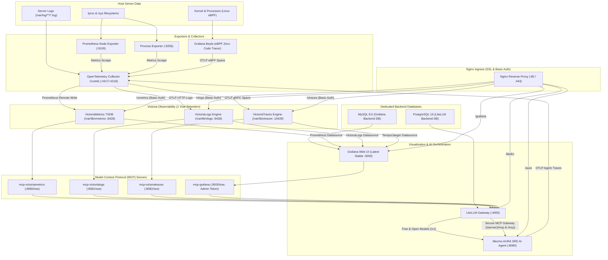

# Observability & AI Stack (o11ystack)

[](https://docs.docker.com/compose/)
[](https://victoriametrics.com/)
[](https://docs.victoriametrics.com/victorialogs/)
[](https://docs.victoriametrics.com/victoriatraces/)
[](https://grafana.com/)
[](https://litellm.ai/)
[](https://github.com/mezmo/aura)
[-purple.svg)](https://modelcontextprotocol.io/)

A complete, production-grade observability and AI orchestration stack running on Docker Compose. It unifies **metrics**, **logs**, **traces (eBPF)**, **interactive dashboards**, **LLM gateway with provisioned free models**, **Model Context Protocol (MCP)** servers, and the autonomous **Mezmo AURA SRE AI Agent** behind a hardened, SSL-enabled Nginx reverse proxy.

---

## Table of Contents

- [Architecture & Data Flow](#architecture--data-flow)
- [Stack Components](#stack-components)
- [Mezmo AURA SRE AI Agent](#mezmo-aura-sre-ai-agent)
- [Free & Open LLM Models](#free--open-llm-models)
- [Prerequisites](#prerequisites)
- [Quick Start](#quick-start)
- [Security & Access Control](#security--access-control)
- [Storage & Retention](#storage--retention)
- [Model Context Protocol (MCP) Integration](#model-context-protocol-mcp-integration)
- [OpenTelemetry & eBPF Auto-Instrumentation](#opentelemetry--ebpf-auto-instrumentation)
- [Verifying the Deployment](#verifying-the-deployment)
- [Operations & Maintenance](#operations--maintenance)
- [Troubleshooting](#troubleshooting)

---

## Architecture & Data Flow



---

## Stack Components

| Service | Docker Image | Port / Transport | Storage & Retention | Description |
| :--- | :--- | :--- | :--- | :--- |
| **VictoriaMetrics** | `victoriametrics/victoria-metrics:latest` | `8428/tcp` | `/var/lib/vmetrics` (1 Year) | Single-node metrics TSDB with PromQL and remote write APIs. |
| **VictoriaLogs** | `victoriametrics/victoria-logs:latest` | `9428/tcp` | `/var/lib/vlogs` (1 Year) | Fast, cost-efficient log database with LogSQL and OTLP log ingestion. |
| **VictoriaTraces** | `victoriametrics/victoria-traces:latest` | `10428/tcp` (HTTP), `4317/tcp` (gRPC) | `/var/lib/vtraces` (1 Year) | High-throughput distributed tracing DB supporting OTLP, Tempo, and Jaeger APIs. |
| **Grafana** | `grafana/grafana:latest` | `3000/tcp` | `grafana-data` volume + MySQL 8.0 | Latest stable Grafana with pre-provisioned datasources for Victorias. |
| **MySQL Backend** | `mysql:8.0` | `3306/tcp` | `mysql-data` volume | Dedicated relational database backend for Grafana state, users, and dashboards. |
| **LiteLLM Proxy** | `ghcr.io/berriai/litellm:main-latest` | `4000/tcp` | PostgreSQL 16 backend | Multi-provider LLM gateway configured with all 4 MCP servers and free model list. |
| **PostgreSQL** | `postgres:16-alpine` | `5432/tcp` | `postgres-data` volume | Relational database backend for LiteLLM key management and call tracking. |
| **Mezmo AURA** | `mezmo/aura:latest` | `8080/tcp` | `/tmp/aura` memory | Autonomous SRE agent with multi-worker orchestration connected to all MCP servers. |
| **MCP VictoriaMetrics** | `ghcr.io/victoriametrics/mcp-victoriametrics` | `8080/tcp` (SSE) | Stateless | Exposes PromQL queries, metrics metadata, cardinalities, and docs as MCP tools. |
| **MCP VictoriaLogs** | `ghcr.io/victoriametrics/mcp-victorialogs` | `8081/tcp` (SSE) | Stateless | Exposes log stream queries, LogSQL filter expressions, and statistics to LLMs. |
| **MCP VictoriaTraces** | `ghcr.io/victoriametrics-community/mcp-victoriatraces` | `8082/tcp` (SSE) | Stateless | Exposes operations, service dependency graphs, and span retrieval to LLMs. |
| **MCP Grafana** | `grafana/mcp-grafana:latest` | `8000/tcp` (SSE) | Stateless | Admin-level Grafana MCP server capable of managing dashboards, alerts, and queries. |
| **Node Exporter** | `prom/node-exporter:latest` | `9100/tcp` | Host `/proc`, `/sys`, `/` | Server hardware telemetry (CPU, RAM, Disks, Networks). |
| **Process Exporter** | `ncabatoff/process-exporter:latest` | `9256/tcp` | Host `/proc`, `pid: host` | Per-process CPU, memory, IO, and fd consumption. |
| **OTel Collector** | `otel/opentelemetry-collector-contrib:latest` | `4317/tcp`, `4318/tcp` | Host `/var/log` | Pipelines server metrics, logs, and distributed traces into Victoria databases. |
| **Grafana Beyla** | `grafana/beyla:latest` | Host eBPF Probes | Linux Kernel | Zero-code, automatic eBPF tracing of all processes (HTTP/gRPC/SQL). |
| **Nginx** | `nginx:alpine` | `80/tcp`, `443/tcp` | SSL Certs + `.htpasswd` | Reverse proxy with default SSL, prefix routing, and Basic Auth protection. |

---

## Mezmo AURA SRE AI Agent

The stack integrates **[Mezmo AURA](https://github.com/mezmo/aura)**, an open-source, multi-agent SRE agent designed for incident investigation, autonomous root-cause analysis, and observability querying.

### Multi-Agent Orchestration Architecture

AURA operates with an **Orchestrator Coordinator** that analyzes user prompts and delegates investigation tasks to 4 domain-specialist workers:

1. **`incident-responder`**:
   - Filter: `grafana` MCP
   - Inspects Grafana active alerts, incident status, provisioned datasources, and dashboard health.
2. **`metrics-analyst`**:
   - Filter: `victoriametrics` MCP
   - Formulates and executes PromQL queries, computes CPU/memory trends, and pinpoints telemetry anomalies.
3. **`log-analyst`**:
   - Filter: `victorialogs` MCP
   - Queries server log streams using LogSQL, analyzes error patterns, and correlates log events across containers.
4. **`trace-analyst`**:
   - Filter: `victoriatraces` MCP
   - Inspects distributed trace spans generated by Beyla eBPF, constructs service dependency graphs, and locates latency bottlenecks.

### Telemetry & Tracing
AURA sends its internal execution spans (subagent turns, tool invocations, and reasoning steps) directly to the OpenTelemetry Collector via `OTEL_EXPORTER_OTLP_ENDPOINT="http://otel-collector:4317"`. These traces are stored in **VictoriaTraces**, allowing SREs to inspect the AI's step-by-step reasoning within Grafana.

---

## Free & Open LLM Models

The stack comes pre-provisioned in `litellm/config.yaml` with free and zero-cost model options so you can start investigating without paid API quotas:

| Model ID | Provider | Cost | Description | Required Environment Variable |
| :--- | :--- | :--- | :--- | :--- |
| `aura-sre-model` | OpenRouter | **Free** | Default SRE model alias mapped to Llama 3.3 70B Free | `OPENROUTER_API_KEY` |
| `openrouter-llama-3.3-70b-free` | OpenRouter | **Free** | `meta-llama/llama-3.3-70b-instruct:free` (128k context) | `OPENROUTER_API_KEY` |
| `openrouter-deepseek-r1-free` | OpenRouter | **Free** | `deepseek/deepseek-r1:free` (DeepSeek reasoning model) | `OPENROUTER_API_KEY` |
| `openrouter-gemini-flash-free` | OpenRouter | **Free** | `google/gemini-2.0-flash-exp:free` (Fast multimodal reasoning) | `OPENROUTER_API_KEY` |
| `openrouter-qwen-coder-free` | OpenRouter | **Free** | `qwen/qwen-2.5-coder-32b-instruct:free` (Code analysis) | `OPENROUTER_API_KEY` |
| `gemini-2.0-flash` | Google AI | **Free Tier** | Official Gemini 2.0 Flash (15 RPM / 1M TPM free tier) | `GEMINI_API_KEY` |
| `groq-llama-3.3-70b` | GroqCloud | **Free Tier** | Llama 3.3 70B Versatile on Groq LPUs (ultra-fast tokens/sec) | `GROQ_API_KEY` |
| `ollama-llama3` | Local Host | **Free (100%)** | Fully offline inference via local Ollama instance | `OLLAMA_API_BASE` |
| `mock-model` | Internal Mock | **Free (Zero Key)** | Mock responses for offline integration testing | None |

### Setting Up Your Free LLM Key
1. Get a free API key:
   - **OpenRouter** (Recommended): [openrouter.ai](https://openrouter.ai/) (Free tier models require $0 balance).
   - **Google AI Studio**: [aistudio.google.com](https://aistudio.google.com/) (Generous 15 RPM free tier).
   - **GroqCloud**: [console.groq.com](https://console.groq.com/) (Free inference tier).
2. Set the key in `.env`:
   ```bash
   OPENROUTER_API_KEY=sk-or-v1-xxxxxxxxxxxxxxxx
   ```
3. Restart LiteLLM and AURA:
   ```bash
   docker compose up -d litellm aura
   ```

---

## Prerequisites

- **Linux OS** with Kernel version >= 5.8 (for eBPF auto-instrumentation)
- **Docker** version >= 24.0
- **Docker Compose** version >= 2.20
- **OpenSSL** (for SSL certificate and htpasswd generation)
- Ports `80` and `443` available on the host

---

## Quick Start

### 1. Clone the Repository
```bash
git clone https://github.com/dirtyren/o11ystack.git
cd o11ystack
```

### 2. Run the Deployment Script
The deployment script prompts interactively for initial credentials on the first run, creates a secure `.env` file (`chmod 600`), generates self-signed SSL certificates, sets up Basic Auth, starts all containers, and automatically bootstraps the Grafana MCP Admin Service Account token.

```bash
chmod +x deploy.sh
./deploy.sh
```

> **Tip**: To re-run or update credentials later, simply run:
> ```bash
> ./deploy.sh --reconfigure
> ```

---

## Security & Access Control

### Reverse Proxy Prefixes (HTTPS on port 443)

All services are accessible through Nginx using SSL by default. Non-secure HTTP requests on port 80 are automatically redirected to HTTPS.

| URL Path | Target Service | Authentication | Description |
| :--- | :--- | :--- | :--- |
| `https://<server>/` | Portal Page | None | Web landing dashboard with direct links to all services. |
| `https://<server>/grafana/` | Grafana | Grafana Login | Full dashboard visualization (Admin user / password). |
| `https://<server>/vmetrics/vmui/` | VictoriaMetrics | **HTTP Basic Auth** | Native VictoriaMetrics web query interface (VMUI). |
| `https://<server>/vlogs/select/vmui/` | VictoriaLogs | **HTTP Basic Auth** | Native VictoriaLogs LogSQL web explorer. |
| `https://<server>/vtraces/select/vmui/` | VictoriaTraces | **HTTP Basic Auth** | Native VictoriaTraces trace explorer. |
| `https://<server>/litellm/` | LiteLLM | LiteLLM Key / Token | LiteLLM AI Gateway interface and OpenAI-compatible API. |
| `https://<server>/aura/` | Mezmo AURA | Web API | OpenAI-compatible SRE AI agent endpoints (`/health`, `/v1/chat/completions`). |

### Basic Authentication
VictoriaMetrics, VictoriaLogs, and VictoriaTraces endpoints are guarded by HTTP Basic Authentication. Credentials are saved in `nginx/.htpasswd` and in `.env` as `BASIC_AUTH_USER` and `BASIC_AUTH_PASSWORD`.

---

## Storage & Retention

The stack enforces 1-year retention on all three Victoria storage backends:

- **VictoriaLogs**: `-storageDataPath=/var/lib/vlogs -retentionPeriod=1y`
- **VictoriaMetrics**: `-storageDataPath=/var/lib/vmetrics -retentionPeriod=1y`
- **VictoriaTraces**: `-storageDataPath=/var/lib/vtraces -retentionPeriod=1y`

Directories on the host (`/var/lib/vlogs`, `/var/lib/vmetrics`, `/var/lib/vtraces`) are automatically created and initialized with appropriate permissions by `deploy.sh`.

---

## Model Context Protocol (MCP) Integration

All four MCP servers run as standalone services within the private Docker network and are registered with **LiteLLM**, which serves as an authenticated **MCP Gateway & Hub**:

```yaml
mcp_servers:
  victoriametrics:
    url: "http://mcp-victoriametrics:8080/sse"
    transport: "sse"
    description: "VictoriaMetrics MCP Server for metrics querying, time series analysis, and alerting rules"

  victorialogs:
    url: "http://mcp-victorialogs:8081/sse"
    transport: "sse"
    description: "VictoriaLogs MCP Server for logs querying, log stream filtering, and log analytics"

  victoriatraces:
    url: "http://mcp-victoriatraces:8082/sse"
    transport: "sse"
    description: "VictoriaTraces MCP Server for tracing operations, service dependency graphs, and span inspection"

  grafana:
    url: "http://mcp-grafana:8000/sse"
    transport: "sse"
    description: "Grafana MCP Server with full Admin permissions for dashboards, data sources, alerts, and panel queries"
```

### LiteLLM MCP Gateway Endpoints
LiteLLM exposes authenticated MCP endpoints (using Streamable HTTP transport and Bearer token auth via `LITELLM_MASTER_KEY`):

| Scope | Internal Docker URL | Reverse Proxy URL | Description |
| :--- | :--- | :--- | :--- |
| **VictoriaMetrics** | `http://litellm:4000/victoriametrics/mcp` | `https://<server>/litellm/victoriametrics/mcp` | PromQL metrics queries, label explorer, and alert rules. |
| **VictoriaLogs** | `http://litellm:4000/victorialogs/mcp` | `https://<server>/litellm/victorialogs/mcp` | LogsQL queries, log stream filtering, and histogram stats. |
| **VictoriaTraces** | `http://litellm:4000/victoriatraces/mcp` | `https://<server>/litellm/victoriatraces/mcp` | Trace retrieval, operation listing, and span graphs. |
| **Grafana** | `http://litellm:4000/grafana/mcp` | `https://<server>/litellm/grafana/mcp` | Dashboard queries, alert rules, and datasource admin tools. |
| **Unified Hub** | `http://litellm:4000/mcp` | `https://<server>/litellm/mcp` | Aggregate MCP endpoint combining all 4 observability tools into one stream. |

### Mezmo AURA Integration via LiteLLM MCP Gateway
Mezmo AURA consumes these tools directly through LiteLLM using Streamable HTTP transport (`http_streamable`) in [`aura/config.toml`](aura/config.toml):

```toml
[mcp.servers.victoriametrics]
transport = "http_streamable"
url = "http://litellm:4000/victoriametrics/mcp"
headers = { Authorization = "Bearer {{ env.LITELLM_MASTER_KEY }}" }
description = "VictoriaMetrics PromQL metrics server via LiteLLM"

[mcp.servers.victorialogs]
transport = "http_streamable"
url = "http://litellm:4000/victorialogs/mcp"
headers = { Authorization = "Bearer {{ env.LITELLM_MASTER_KEY }}" }
description = "VictoriaLogs LogSQL server via LiteLLM"

[mcp.servers.victoriatraces]
transport = "http_streamable"
url = "http://litellm:4000/victoriatraces/mcp"
headers = { Authorization = "Bearer {{ env.LITELLM_MASTER_KEY }}" }
description = "VictoriaTraces distributed tracing server via LiteLLM"

[mcp.servers.grafana]
transport = "http_streamable"
url = "http://litellm:4000/grafana/mcp"
headers = { Authorization = "Bearer {{ env.LITELLM_MASTER_KEY }}" }
description = "Grafana dashboard, alerts, and datasources server via LiteLLM"

[mcp.servers.litellm-hub]
transport = "http_streamable"
url = "http://litellm:4000/mcp"
headers = { Authorization = "Bearer {{ env.LITELLM_MASTER_KEY }}" }
description = "LiteLLM Unified Observability MCP Hub"
```

Benefits of this routing:
- **Unified Security**: All tool calls require valid Bearer token authentication through LiteLLM.
- **Audit Logging**: LiteLLM logs all MCP tool calls, parameters, and latencies in its PostgreSQL database.
- **Granular Scoping**: AURA's domain specialist workers (`incident-responder`, `metrics-analyst`, `log-analyst`, `trace-analyst`) continue to be isolated by their `mcp_filter`.

### Automated Full Permissions for Grafana MCP
The setup script (`scripts/setup-grafana-mcp.sh`) automatically:
1. Waits for Grafana to complete its initial MySQL database migrations.
2. Creates a dedicated Service Account named `mcp-grafana` with **Admin** role in Grafana.
3. Generates an unexpiring Service Account Token.
4. Stores it in `.env` as `GRAFANA_SERVICE_ACCOUNT_TOKEN` and passes it to the `mcp-grafana` container.

---

## OpenTelemetry & eBPF Auto-Instrumentation

The OpenTelemetry Collector (`otel-collector`) runs with three pipelines:

1. **Metrics Pipeline**:
   - **Receivers**: Prometheus receiver scrapes `node-exporter:9100` and `process-exporter:9256`.
   - **Exporter**: `prometheusremotewrite` exports metrics directly to `http://victoriametrics:8428/api/v1/write`.
2. **Logs Pipeline**:
   - **Receivers**: `filelog` receiver tails `/var/log/**/*.log`, `/var/log/syslog`, and `/var/log/messages`.
   - **Exporter**: `otlphttp/logs` ships logs formatted to VictoriaLogs at `http://victorialogs:9428/insert/opentelemetry/v1/logs`.
3. **Traces Pipeline**:
   - **Receivers**: `otlp` gRPC/HTTP receiver on ports `4317` and `4318`.
   - **Source**: **Grafana Beyla** attaches eBPF kernel probes across all running host processes without requiring code modification, streaming trace spans into the collector.
   - **Exporter**: `otlp/traces` forwards spans to `victoriatraces:4317`.

---

## Verifying the Deployment

Run these commands on the host to verify each pipeline:

```bash
source .env

# 1. Verify Nginx Landing Page
curl -k -s -o /dev/null -w "%{http_code}\n" https://localhost/

# 2. Check Metrics Ingestion in VictoriaMetrics
curl -k -s -u "${BASIC_AUTH_USER}:${BASIC_AUTH_PASSWORD}" \
  "https://localhost/vmetrics/api/v1/label/__name__/values" | grep "node_"

# 3. Check Server Logs Ingestion in VictoriaLogs
curl -k -s -u "${BASIC_AUTH_USER}:${BASIC_AUTH_PASSWORD}" \
  "https://localhost/vlogs/select/logsql/hits?query=*&step=1d"

# 4. Check eBPF Process Traces in VictoriaTraces
curl -k -s -u "${BASIC_AUTH_USER}:${BASIC_AUTH_PASSWORD}" \
  "https://localhost/vtraces/select/jaeger/api/services"

# 5. Check Grafana Datasources Provisioning
curl -k -s -u "${GRAFANA_ADMIN_USER}:${GRAFANA_ADMIN_PASSWORD}" \
  "https://localhost/grafana/api/datasources"

# 6. Check LiteLLM Readiness
curl -k -s https://localhost/litellm/health/readiness

# 7. Check Mezmo AURA SRE Agent Health
curl -k -s https://localhost/aura/health | jq .

# 8. Query Mezmo AURA SRE Agent via OpenAI-compatible endpoint
curl -k -s -X POST https://localhost/aura/v1/chat/completions \
  -H "Content-Type: application/json" \
  -d '{"messages":[{"role":"user","content":"Run a complete system observability check across metrics, logs, and traces."}]}' | jq .
```

---

## Operations & Maintenance

```bash
# Check running container statuses
docker compose ps

# View live aggregate logs
docker compose logs -f

# View specific service logs
docker compose logs -f otel-collector
docker compose logs -f beyla
docker compose logs -f litellm
docker compose logs -f aura
docker compose logs -f mcp-grafana

# Restart a specific service
docker compose restart nginx

# Stop the entire stack
docker compose down

# Stop and remove persistent data volumes (CAUTION: deletes DB data)
docker compose down -v
```

---

## Directory Structure

```
.
├── docker-compose.yml                     # Main service definitions (17 services)
├── deploy.sh                              # Interactive deployment script
├── .env.example                           # Configuration environment template
├── .gitignore                             # Git ignore rules for secrets
├── README.md                              # This documentation
├── aura/
│   └── config.toml                        # Mezmo AURA multi-agent coordinator & worker config
├── grafana/
│   └── provisioning/
│       └── datasources/
│           └── datasources.yaml           # Automated datasource definitions
├── litellm/
│   └── config.yaml                        # LiteLLM proxy, free models & MCP servers configuration
├── nginx/
│   ├── nginx.conf                         # Primary Nginx configuration
│   ├── default.conf                       # HTTPS server & reverse proxy routes
│   └── certs/                             # SSL certificates directory (.pem)
├── otel-collector/
│   └── otel-collector-config.yaml         # OpenTelemetry Collector pipelines
├── process-exporter/
│   └── process-exporter.yml               # Process match rules for process-exporter
└── scripts/
    └── setup-grafana-mcp.sh               # Grafana MCP Admin Service Account provisioner
```

---

## License

This project is licensed under the MIT License.

