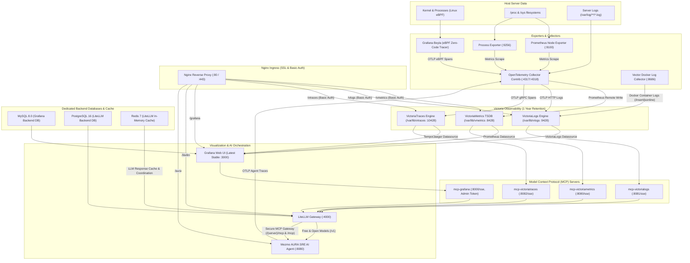
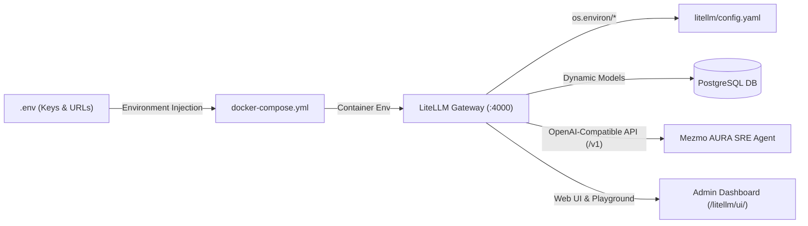

# Observability & AI Stack (o11ystack)

[](https://docs.docker.com/compose/)
[](https://victoriametrics.com/)
[](https://docs.victoriametrics.com/victorialogs/)
[](https://docs.victoriametrics.com/victoriatraces/)
[](https://grafana.com/)
[](https://litellm.ai/)
[](https://github.com/mezmo/aura)
[-purple.svg)](https://modelcontextprotocol.io/)

A complete, production-grade observability and AI orchestration stack running on Docker Compose. It unifies **metrics**, **logs**, **traces (eBPF)**, **interactive dashboards**, **LLM gateway with provisioned free models**, **Model Context Protocol (MCP)** servers, and the autonomous **Mezmo AURA SRE AI Agent** behind a hardened, SSL-enabled Nginx reverse proxy.

---

## Table of Contents

- [Architecture & Data Flow](#architecture--data-flow)
- [Stack Components](#stack-components)
- [Mezmo AURA SRE AI Agent](#mezmo-aura-sre-ai-agent)
- [Giving LiteLLM Access to Models](#giving-litellm-access-to-models)
- [Prerequisites](#prerequisites)
- [Quick Start](#quick-start)
- [Configuration Reference (.env.example)](#configuration-reference-envexample)
- [Security & Access Control](#security--access-control)
- [Storage & Retention](#storage--retention)
- [Grafana Datasources & Pre-Installed Dashboards](#grafana-datasources--pre-installed-dashboards)
- [Model Context Protocol (MCP) Integration](#model-context-protocol-mcp-integration)
- [OpenTelemetry & eBPF Auto-Instrumentation](#opentelemetry--ebpf-auto-instrumentation)
- [Container Resource Telemetry & Actionable Recommendations](#container-resource-telemetry--actionable-recommendations)
- [Verifying the Deployment](#verifying-the-deployment)
- [Operations & Maintenance](#operations--maintenance)
- [Troubleshooting](#troubleshooting)

---

## Architecture & Data Flow



---

## Stack Components

| Service | Docker Image | Port / Transport | Storage & Retention | Description |
| :--- | :--- | :--- | :--- | :--- |
| **VictoriaMetrics** | `victoriametrics/victoria-metrics:v1.152.0` | `8428/tcp` | `/var/lib/vmetrics` (1 Year) | Single-node metrics TSDB with PromQL and remote write APIs. |
| **VictoriaLogs** | `victoriametrics/victoria-logs:v1.52.0` | `9428/tcp` | `/var/lib/vlogs` (1 Year) | Fast, cost-efficient log database with LogSQL and OTLP log ingestion. |
| **VictoriaTraces** | `victoriametrics/victoria-traces:v0.11.0` | `10428/tcp` (HTTP), `4317/tcp` (gRPC) | `/var/lib/vtraces` (1 Year) | High-throughput distributed tracing DB supporting OTLP, Tempo, and Jaeger APIs. |
| **Grafana** | `grafana/grafana:13.2.1` | `3000/tcp` | `grafana-data` volume + MySQL 8.0 | Latest stable Grafana with pre-provisioned datasources for Victorias. |
| **MySQL Backend** | `mysql:8.0.46` | `3306/tcp` | `mysql-data` volume | Dedicated relational database backend for Grafana state, users, and dashboards. |
| **LiteLLM Proxy** | `ghcr.io/berriai/litellm:v1.100.1` | `4000/tcp` | PostgreSQL 16 backend | Multi-provider LLM gateway configured with all 4 MCP servers and free model list. |
| **PostgreSQL** | `postgres:16.15-alpine` | `5432/tcp` | `postgres-data` volume | Relational database backend for LiteLLM key management and call tracking. |
| **Redis Cache** | `redis:7.4.11-alpine` | `6379/tcp` | `redis-data` volume | In-memory cache for LiteLLM response caching, spend counters, and cross-replica coordination. |
| **Mezmo AURA** | `mezmo/aura:0.2.17` | `8080/tcp` | `/tmp/aura` memory | Autonomous SRE agent with multi-worker orchestration connected to all MCP servers. |
| **MCP VictoriaMetrics** | `ghcr.io/victoriametrics/mcp-victoriametrics:v1.20.2` | `8080/tcp` (SSE) | Stateless | Exposes PromQL queries, metrics metadata, cardinalities, and docs as MCP tools. |
| **MCP VictoriaLogs** | `ghcr.io/victoriametrics/mcp-victorialogs:v1.9.0` | `8081/tcp` (SSE) | Stateless | Exposes log stream queries, LogSQL filter expressions, and statistics to LLMs. |
| **MCP VictoriaTraces** | `ghcr.io/victoriametrics-community/mcp-victoriatraces:v1.5.0` | `8082/tcp` (SSE) | Stateless | Exposes operations, service dependency graphs, and span retrieval to LLMs. |
| **MCP Grafana** | `grafana/mcp-grafana:1.4.1` | `8000/tcp` (SSE) | Stateless | Admin-level Grafana MCP server capable of managing dashboards, alerts, and queries. |
| **Node Exporter** | `prom/node-exporter:v1.12.1` | `9100/tcp` | Host `/proc`, `/sys`, `/` | Server hardware telemetry (CPU, RAM, Disks, Networks). |
| **Process Exporter** | `ncabatoff/process-exporter:v0.8.7` | `9256/tcp` | Host `/proc`, `pid: host` | Per-process CPU, memory, IO, and fd consumption. |
| **cAdvisor** | `gcr.io/cadvisor/cadvisor:v0.49.1` | `8080/tcp` | Host `/sys`, `/var/lib/docker`, `/dev/disk` | Per-container cgroup resource limits, CPU throttling, and working set memory telemetry. |
| **OTel Collector** | `otel/opentelemetry-collector-contrib:0.160.0` | `4317/tcp`, `4318/tcp` | Host `/var/log` | Pipelines server metrics, logs, and distributed traces into Victoria databases. |
| **Vector** | `timberio/vector:0.58.0-alpine` | `8686/tcp` | `vector-data` volume | High-performance log collector streaming all Docker Compose container stdout/stderr into VictoriaLogs. |
| **Grafana Beyla** | `grafana/beyla:3.35.0` | Host eBPF Probes | Linux Kernel | Zero-code, automatic eBPF tracing of all processes (HTTP/gRPC/SQL). |
| **Nginx** | `nginx:1.31.5-alpine` | `80/tcp`, `443/tcp` | SSL Certs + `.htpasswd` | Reverse proxy with default SSL, prefix routing, and Basic Auth protection. |

> [!NOTE]
> All images in the stack are strictly pinned to verified semantic versions for predictable deployments, safe migrations, and deterministic rollbacks. For detailed breaking changes analysis, database persistence nuances, and step-by-step upgrade procedures, refer to the [Migration & Version Pinning Guide](docs/MIGRATION_GUIDE.md).

---

## Mezmo AURA SRE AI Agent

The stack integrates **[Mezmo AURA](https://github.com/mezmo/aura)**, an open-source, multi-agent SRE agent designed for incident investigation, autonomous root-cause analysis, and observability querying.

### Multi-Agent Orchestration Architecture

AURA operates with an **Orchestrator Coordinator** that analyzes user prompts and delegates investigation tasks to 4 domain-specialist workers:

1. **`incident-responder`**:
   - Filter: `grafana` MCP
   - Inspects Grafana active alerts, incident status, provisioned datasources, and dashboard health.
2. **`metrics-analyst`**:
   - Filter: `victoriametrics` MCP
   - Formulates and executes PromQL queries, computes CPU/memory trends, and pinpoints telemetry anomalies.
3. **`log-analyst`**:
   - Filter: `victorialogs` MCP
   - Queries server log streams using LogSQL, analyzes error patterns, and correlates log events across containers.
4. **`trace-analyst`**:
   - Filter: `victoriatraces` MCP
   - Inspects distributed trace spans generated by Beyla eBPF, constructs service dependency graphs, and locates latency bottlenecks.

### Native Grafana Application Plugin (`mezmo-aura-app`)

AURA is integrated directly into Grafana as a native Application Plugin pre-provisioned via `grafana/provisioning/plugins/plugins.yaml`. Observability and SRE teams can execute autonomous investigations inside Grafana without leaving their dashboards or needing separate Basic Auth credentials:

- **Direct URL**: **`https://<server>/grafana/a/mezmo-aura-app/console`** (or navigate to **Apps > Mezmo AURA SRE** in the Grafana sidebar).
- **Single Sign-On**: Requests are proxied securely through Grafana's backend to `http://aura:8080`, inheriting the active Grafana operator session.
- **Key Features**:
  - **📋 1-Click Investigation Copy**: Dedicated copy button on SRE reports for instant sharing of findings, telemetry queries, and root causes into incident war rooms (Slack, Jira, PagerDuty).
  - **⏱ Live & Recorded Elapsed Time**: Real-time investigation timer during multi-turn orchestration with a persistent duration badge (`⏱ XXs / XXms`) on completion.
  - **Quick Triage Chips**: Pre-canned 1-click investigation triggers for Log Triage, CPU/Memory Anomalies, Trace Latency Outliers, Active Alerts, and Full SRE Audits.
  - **Reasoning Traces Integration**: 1-click jump to Grafana Explore with `VictoriaTraces` and `service="aura"` pre-filtered.
  - **Specialist Telemetry Tab**: Real-time status for the 4 specialist workers and 216 live MCP tools.
  - **💾 Background Investigation Persistence**: Investigations run as server-side A2A tasks and persist to browser `localStorage` (scoped per Grafana user/org), so navigating to dashboards or other screens no longer aborts a run — it continues in the background and shows **in progress** or **completed** on return.

### Telemetry & Tracing
AURA sends its internal execution spans (subagent turns, tool invocations, and reasoning steps) directly to the OpenTelemetry Collector via `OTEL_EXPORTER_OTLP_ENDPOINT="http://otel-collector:4317"`. These traces are stored in **VictoriaTraces**, allowing SREs to inspect the AI's step-by-step reasoning within Grafana.

> 📖 **Comprehensive AURA Guide**: See [**README-AURA.md**](README-AURA.md) for full interactive terminal usage, REST API integrations (curl / Python), real-world SRE use cases, native Grafana app usage, and trace auditing.

---

## Giving LiteLLM Access to Models

LiteLLM functions as the unified AI Gateway for the entire observability stack. It handles authentication, load balancing, rate limiting, token usage tracking, and connects both human operators and autonomous agents (like Mezmo AURA) to any LLM provider.

### How Model Authentication Works

Credentials flow through a secure 3-stage pipeline:
1. **Secrets stored in `.env`**: API keys and endpoint URLs are kept strictly in `.env` (`chmod 600`), never hardcoded in git.
2. **Passed via `docker-compose.yml`**: Docker injects keys as environment variables into the `litellm` container.
3. **Resolved in `litellm/config.yaml`**: LiteLLM references keys dynamically using `os.environ/<KEY_NAME>`, or queries credentials stored in its PostgreSQL database (`store_model_in_db: true`).



---

### Pre-Configured Models Matrix

The stack comes pre-configured with free, local, commercial, and mock models:

| Model Alias | Provider | Cost / Tier | Context | Description | Required `.env` Variable |
| :--- | :--- | :--- | :--- | :--- | :--- |
| `aura-sre-model` | OpenRouter | **Free** | 128k | Default SRE model alias mapped to Llama 3.3 70B Free | `OPENROUTER_API_KEY` |
| `openrouter-llama-3.3-70b-free` | OpenRouter | **Free** | 128k | `meta-llama/llama-3.3-70b-instruct:free` | `OPENROUTER_API_KEY` |
| `openrouter-deepseek-r1-free` | OpenRouter | **Free** | 64k | `deepseek/deepseek-r1:free` (Reasoning model) | `OPENROUTER_API_KEY` |
| `openrouter-gemini-flash-free` | OpenRouter | **Free** | 1M | `google/gemini-2.0-flash-exp:free` (Multimodal) | `OPENROUTER_API_KEY` |
| `openrouter-qwen-coder-free` | OpenRouter | **Free** | 32k | `qwen/qwen-2.5-coder-32b-instruct:free` | `OPENROUTER_API_KEY` |
| `gemini-3.8-flash` | Google AI | **Free Tier** | 1M | Google Gemini 3.8 Flash (15 RPM / 1M TPM free tier) | `GEMINI_API_KEY` |
| `groq-llama-3.3-70b` | GroqCloud | **Free Tier** | 128k | Llama 3.3 70B Versatile on ultra-fast Groq LPUs | `GROQ_API_KEY` |
| `ollama-llama3` | Local Host | **Free (100%)** | Local | Offline local inference via Ollama (Zero API keys) | `OLLAMA_API_BASE` |
| `gpt-4o` | OpenAI | Paid / Tier | 128k | OpenAI flagship GPT-4o model | `OPENAI_API_KEY` |
| `gpt-4o-mini` | OpenAI | Low-Cost | 128k | Lightweight, cost-efficient GPT-4o mini | `OPENAI_API_KEY` |
| `claude-3-5-sonnet` | Anthropic | Paid / Tier | 200k | Anthropic Claude 3.5 Sonnet | `ANTHROPIC_API_KEY` |
| `mock-model` | Internal Mock | **Free (Zero Key)** | 16k | Built-in mock for offline integration testing | None (Works immediately) |

---

### Step-by-Step: Providing Model Access

#### Option 1: Free Cloud Providers (Zero-Cost, No Credit Card Required)

1. **OpenRouter (Recommended)**:
   - Create a free account at [openrouter.ai](https://openrouter.ai/).
   - Generate an API key with $0 balance at [openrouter.ai/keys](https://openrouter.ai/keys).
   - In `.env`, set:
     ```bash
     OPENROUTER_API_KEY=sk-or-v1-xxxxxxxxxxxxxxxxxxxxxxxxxxxxxxxx
     ```
   - This unlocks 5 free models: `aura-sre-model`, `openrouter-llama-3.3-70b-free`, `openrouter-deepseek-r1-free`, `openrouter-gemini-flash-free`, and `openrouter-qwen-coder-free`.

2. **Google AI Studio (Gemini Free Tier)**:
   - Obtain a key from [aistudio.google.com](https://aistudio.google.com/) (free tier allows up to 15 Requests Per Minute and 1M Tokens Per Minute).
   - In `.env`, set:
     ```bash
     GEMINI_API_KEY=AIzaSyxxxxxxxxxxxxxxxxxxxxxxxxxxxxxxx
     ```
   - This unlocks `gemini-3.8-flash`.

3. **GroqCloud (Ultra-Fast Inference Free Tier)**:
   - Obtain a key from [console.groq.com](https://console.groq.com/).
   - In `.env`, set:
     ```bash
     GROQ_API_KEY=gsk_xxxxxxxxxxxxxxxxxxxxxxxxxxxxxxxx
     ```
   - This unlocks `groq-llama-3.3-70b`.

#### Option 2: Local Offline Inference with Ollama (100% Private, Zero API Keys)

Run LLMs directly on the host machine without any network egress:

1. Install and start [Ollama](https://ollama.com/) on the host:
   ```bash
   # Pull the desired model
   ollama run llama3.2
   ```
2. By default, Ollama listens on `127.0.0.1:11434`. To allow Docker containers to access it, ensure Ollama binds to all interfaces:
   ```bash
   # On Linux systemd service:
   # Add Environment="OLLAMA_HOST=0.0.0.0:11434" to /etc/systemd/system/ollama.service
   systemctl daemon-reload && systemctl restart ollama
   ```
3. In `.env`, configure the base URL:
   ```bash
   OLLAMA_API_BASE=http://host.docker.internal:11434
   ```
   *(Or specify the host IP directly, e.g. `http://172.17.0.1:11434`)*.

#### Option 3: Commercial & Enterprise Cloud Providers

To enable standard proprietary LLMs, add your respective keys to `.env`:

```bash
# OpenAI
OPENAI_API_KEY=sk-proj-xxxxxxxxxxxxxxxx

# Anthropic
ANTHROPIC_API_KEY=sk-ant-xxxxxxxxxxxxxxxx

# Mistral AI
MISTRAL_API_KEY=xxxxxxxxxxxxxxxxxxxxxxxx

# Amazon Bedrock
AWS_ACCESS_KEY_ID=AKIAxxxxxxxxxxxxxxxx
AWS_SECRET_ACCESS_KEY=xxxxxxxxxxxxxxxxxxxxxxxxxxxxxxxx
AWS_REGION_NAME=us-east-1

# Azure OpenAI
AZURE_API_KEY=xxxxxxxxxxxxxxxxxxxxxxxxxxxxxxxx
AZURE_API_BASE=https://your-resource-name.openai.azure.com/
AZURE_API_VERSION=2024-08-01-preview
```

#### Option 4: Zero-Key Testing (`mock-model`)

If you don't have any API keys configured yet, LiteLLM includes `mock-model`. It returns instant, deterministic mock responses for end-to-end testing of AURA, LiteLLM, and reverse proxy routing without requiring internet access or credentials.

---

### Directing Mezmo AURA to Use a Model

Mezmo AURA reads its LLM model from the `AURA_MODEL` environment variable. To change which model AURA uses for investigations:

1. Set `AURA_MODEL` in `.env` to any valid model alias from the matrix above:
   ```bash
   # Use OpenRouter free Llama 3.3 (default)
   AURA_MODEL=aura-sre-model

   # Or switch to Google Gemini Flash
   AURA_MODEL=gemini-3.8-flash

   # Or switch to Groq ultra-fast Llama 3.3
   AURA_MODEL=groq-llama-3.3-70b

   # Or switch to OpenAI GPT-4o
   AURA_MODEL=gpt-4o

   # Or switch to offline mock model
   AURA_MODEL=mock-model
   ```

2. Apply the change:
   ```bash
   docker compose up -d litellm aura
   ```

---

### Verifying Model Access via CLI

Test your models directly from the command line using the LiteLLM API:

```bash
source .env

# 1. List all registered models
curl -k -s -H "Authorization: Bearer ${LITELLM_MASTER_KEY}" \
  https://localhost/litellm/models | jq '.data[].id'

# 2. Test chat completion on a specific model (e.g. mock-model)
curl -k -s -X POST https://localhost/litellm/v1/chat/completions \
  -H "Content-Type: application/json" \
  -H "Authorization: Bearer ${LITELLM_MASTER_KEY}" \
  -d '{
    "model": "mock-model",
    "messages": [{"role": "user", "content": "System status check"}]
  }' | jq .

# 3. Test chat completion on a live cloud model (e.g. gemini-3.8-flash)
curl -k -s -X POST https://localhost/litellm/v1/chat/completions \
  -H "Content-Type: application/json" \
  -H "Authorization: Bearer ${LITELLM_MASTER_KEY}" \
  -d '{
    "model": "gemini-3.8-flash",
    "messages": [{"role": "user", "content": "Reply with PONG"}]
  }' | jq .

# 4. Trigger Mezmo AURA SRE investigation using the configured AURA_MODEL (requires Basic Auth)
curl -k -s -u "${BASIC_AUTH_USER}:${BASIC_AUTH_PASSWORD}" \
  -X POST https://localhost/aura/v1/chat/completions \
  -H "Content-Type: application/json" \
  -d '{
    "messages": [{"role": "user", "content": "Inspect recent database error rates across logs and metrics."}]
  }' | jq .
```

---

### LiteLLM Admin UI & Interactive Playground

LiteLLM includes an interactive web dashboard accessible via Nginx:

1. Open **`https://<server>/litellm/ui/`** in your browser.
2. Sign in with:
   - **Username**: `admin`
   - **Password**: Your `LITELLM_MASTER_KEY` configured in `.env`
3. Features available in the UI:
   - **Models**: View all loaded models, test latency, and check status.
   - **Add Model**: Dynamically add new models or provider keys at runtime without editing configuration files or restarting containers (persisted automatically to PostgreSQL).
   - **Playground**: Test prompts and models directly from an interactive chat interface.
   - **API Keys**: Generate scoped virtual API keys with spend limits and rate limits for individual teams or applications.
   - **Logs & Analytics**: Inspect token usage, costs per model, and latency histograms.


---

## Prerequisites

- **Linux OS** with Kernel version >= 5.8 (for eBPF auto-instrumentation)
- **Docker** version >= 24.0
- **Docker Compose** version >= 2.20
- **OpenSSL** (for SSL certificate and htpasswd generation)
- Ports `80` and `443` available on the host

---

## Quick Start

### 1. Clone the Repository
```bash
git clone https://github.com/dirtyren/o11ystack.git
cd o11ystack
```

### 2. Run the Deployment Script
The deployment script prompts interactively for initial credentials on the first run, creates a secure `.env` file (`chmod 600`), generates self-signed SSL certificates, sets up Basic Auth, starts all containers, and automatically bootstraps the Grafana MCP Admin Service Account token.

```bash
chmod +x deploy.sh
./deploy.sh
```

> **Tip**: To re-run or update credentials later, simply run:
> ```bash
> ./deploy.sh --reconfigure
> ```

---

## Configuration Reference (`.env.example`)

The stack uses a single `.env` file (copied from `.env.example` or initialized interactively by `deploy.sh`) to centrally configure server networking, storage directories, database passwords, security keys, and LLM credentials.

### Environment Variables Directory

| Variable | Default / Format | Category | Description |
| :--- | :--- | :--- | :--- |
| `SERVER_HOST` | `localhost` / `neoson-o11y.duckdns.org` | Server & Network | Domain or IP address used in Nginx SSL certificates and reverse proxy links. |
| `SERVER_PROTOCOL` | `https` | Server & Network | Web access protocol (`https` recommended, SSL enabled by default). |
| `DUCKDNS_TOKEN` | *(empty)* | Dynamic DNS & SSL | DuckDNS API token for automated dynamic DNS synchronization and Let's Encrypt DNS-01 ACME challenge. |
| `DUCKDNS_SUBDOMAINS` | `neoson-o11y` | Dynamic DNS & SSL | DuckDNS subdomain name (`<subdomain>.duckdns.org`). |
| `DUCKDNS_DOMAIN` | `duckdns.org` | Dynamic DNS & SSL | DuckDNS base domain. |
| `HTTP_PORT` | `80` | Server & Network | Inbound host HTTP port, automatically redirected to HTTPS. |
| `HTTPS_PORT` | `443` | Server & Network | Inbound host HTTPS port terminating TLS/SSL. |
| `VLOGS_DATA_PATH` | `/var/lib/vlogs` | Storage & Retention | Host storage directory for VictoriaLogs (retains logs for 1 year). |
| `VMETRICS_DATA_PATH` | `/var/lib/vmetrics` | Storage & Retention | Host storage directory for VictoriaMetrics TSDB (retains metrics for 1 year). |
| `VTRACES_DATA_PATH` | `/var/lib/vtraces` | Storage & Retention | Host storage directory for VictoriaTraces (retains traces for 1 year). |
| `BASIC_AUTH_USER` | `admin` | Security | Basic Auth username guarding `/vmetrics`, `/vlogs`, and `/vtraces` web interfaces. |
| `BASIC_AUTH_PASSWORD` | `changeme_basic_auth` | Security | Basic Auth password stored in encrypted `nginx/.htpasswd`. |
| `GRAFANA_ADMIN_USER` | `admin` | Grafana | Initial administrator username for Grafana web portal. |
| `GRAFANA_ADMIN_PASSWORD` | `changeme_grafana_admin` | Grafana | Initial administrator password for Grafana web portal. |
| `MYSQL_ROOT_PASSWORD` | `changeme_mysql_root` | Backend Databases | Root password for MySQL 8.0 backing Grafana. |
| `GRAFANA_DB_PASSWORD` | `changeme_grafana_db` | Backend Databases | Dedicated user password for Grafana's `grafana` database. |
| `POSTGRES_USER` | `litellm` | Backend Databases | Dedicated PostgreSQL user for LiteLLM. |
| `POSTGRES_PASSWORD` | `changeme_postgres_litellm` | Backend Databases | PostgreSQL password for LiteLLM key storage and audit logging. |
| `REDIS_PASSWORD` | `changeme_redis` | Backend Databases & Cache | Password for Redis 7 in-memory cache and cross-pod coordination. |
| `LITELLM_MASTER_KEY` | `sk-litellm-master-key-...` | LiteLLM Gateway | Bearer token for LiteLLM Admin UI login (`admin`) and secure MCP / REST APIs. |
| `PROXY_BASE_URL` | `https://localhost/litellm` | LiteLLM Gateway | Public base URL for LiteLLM UI Playground and client SDKs (must include `http://` or `https://`). |
| `AURA_MODEL` | `aura-sre-model` | Mezmo AURA AI | Active LLM model alias consumed by Mezmo AURA SRE Agent from LiteLLM. |
| `OPENROUTER_API_KEY` | *(empty)* | Free Tier LLM | OpenRouter API key unlocking free Llama 3.3 70B, DeepSeek R1, Qwen, and Gemini Flash. |
| `GEMINI_API_KEY` | *(empty)* | Free Tier LLM | Google AI Studio API key for `gemini-3.8-flash` (15 RPM / 1M TPM free tier). |
| `GROQ_API_KEY` | *(empty)* | Free Tier LLM | GroqCloud API key for `groq-llama-3.3-70b` (ultra-fast inference free tier). |
| `OLLAMA_API_BASE` | `http://host.docker.internal:11434` | Local Offline LLM | Base URL to a local Ollama instance running on the host machine. |
| `OPENAI_API_KEY` | *(empty)* | Commercial LLM (Optional) | OpenAI API key for `gpt-4o` and `gpt-4o-mini`. |
| `ANTHROPIC_API_KEY` | *(empty)* | Commercial LLM (Optional) | Anthropic API key for `claude-3-5-sonnet`. |
| `MISTRAL_API_KEY` | *(empty)* | Commercial LLM (Optional) | Mistral API key for Mistral models. |
| `COHERE_API_KEY` | *(empty)* | Commercial LLM (Optional) | Cohere API key for Command-R/Command-R+ models. |
| `AWS_ACCESS_KEY_ID` | *(empty)* | Enterprise LLM (Optional) | AWS Access Key ID for Amazon Bedrock models. |
| `AWS_SECRET_ACCESS_KEY` | *(empty)* | Enterprise LLM (Optional) | AWS Secret Access Key for Amazon Bedrock models. |
| `AWS_REGION_NAME` | *(empty)* | Enterprise LLM (Optional) | AWS Region (e.g., `us-east-1`) for Amazon Bedrock models. |
| `AZURE_API_KEY` | *(empty)* | Enterprise LLM (Optional) | Azure OpenAI API key. |
| `AZURE_API_BASE` | *(empty)* | Enterprise LLM (Optional) | Azure OpenAI endpoint URL (`https://<resource>.openai.azure.com/`). |
| `AZURE_API_VERSION` | *(empty)* | Enterprise LLM (Optional) | Azure OpenAI API version (e.g., `2024-08-01-preview`). |
| `GRAFANA_SERVICE_ACCOUNT_TOKEN` | *(auto-generated)* | Grafana MCP | Admin Service Account token auto-generated by `deploy.sh` for `mcp-grafana`. |

---

## Security & Access Control

### Reverse Proxy Prefixes (HTTPS on port 443)

All services are accessible through Nginx using SSL by default. Non-secure HTTP requests on port 80 are automatically redirected to HTTPS.

| URL Path | Target Service | Authentication | Description |
| :--- | :--- | :--- | :--- |
| `https://<server>/` | Portal Page | None | Web landing dashboard with direct links to all services. |
| `https://<server>/grafana/` | Grafana | Grafana Login | Full dashboard visualization (Admin user / password). |
| `https://<server>/vmetrics/vmui/` | VictoriaMetrics | **HTTP Basic Auth** | Native VictoriaMetrics web query interface (VMUI). |
| `https://<server>/vlogs/select/vmui/` | VictoriaLogs | **HTTP Basic Auth** | Native VictoriaLogs LogSQL web explorer. |
| `https://<server>/vtraces/select/vmui/` | VictoriaTraces | **HTTP Basic Auth** | Native VictoriaTraces trace explorer. |
| `https://<server>/litellm/` | LiteLLM | LiteLLM Key / Token | LiteLLM AI Gateway interface and OpenAI-compatible API. |
| `https://<server>/aura/` | Mezmo AURA | **HTTP Basic Auth** | OpenAI-compatible SRE AI agent endpoints (`/health`, `/v1/chat/completions`) & standalone console. |
| `https://<server>/grafana/a/mezmo-aura-app/console` | Grafana App | Grafana Login | Native Mezmo AURA SRE AI Agent console embedded directly in Grafana. |

### Basic Authentication
VictoriaMetrics, VictoriaLogs, VictoriaTraces, and Mezmo AURA endpoints are guarded by HTTP Basic Authentication. Credentials are saved in `nginx/.htpasswd` and in `.env` as `BASIC_AUTH_USER` and `BASIC_AUTH_PASSWORD`.

---

## Storage & Retention

### Victoria Observability Retention (1 Year)
The stack enforces 1-year retention on all three Victoria storage backends:

- **VictoriaLogs**: `-storageDataPath=/var/lib/vlogs -retentionPeriod=1y`
- **VictoriaMetrics**: `-storageDataPath=/var/lib/vmetrics -retentionPeriod=1y`
- **VictoriaTraces**: `-storageDataPath=/var/lib/vtraces -retentionPeriod=1y`

Directories on the host (`/var/lib/vlogs`, `/var/lib/vmetrics`, `/var/lib/vtraces`) are automatically created and initialized with appropriate permissions by `deploy.sh`.

### LiteLLM Spend Logs Retention & Prompt Storage (7 Days)
LiteLLM is configured with automated spend log auditing and bounded cleanup:
- **Prompt Storage**: `store_prompts_in_spend_logs: true` logs request prompts and model responses for compliance, spend attribution, and debugging.
- **Retention Period**: `maximum_spend_logs_retention_period: "7d"` retains spend logs for 7 days.
- **Cleanup Schedule**: Automated daily pruning at 04:00 AM (`maximum_spend_logs_cleanup_cron: "0 4 * * *"`).
- **Safety Bounds**: Bounded batches (`batch_size: 1000`, `max_batches: 500`) with a maximum execution budget (`run_budget: "5m"`, `batch_timeout: "30s"`) to avoid database lock contention.

### LiteLLM Redis In-Memory Cache & Cluster Coordination
The stack includes a dedicated **Redis 7** instance (`redis:7-alpine`) providing:
- **LLM Response Caching**: Identical prompts and parameters are cached in Redis with ultra-low latency (`x-litellm-cache-key`), saving inference latency and API tokens.
- **Cluster Coordination**: Centralized Redis storage for real-time spend counters, model rate-limiting (`RPM`/`TPM`), and session state.

---

## Grafana Datasources & Pre-Installed Dashboards

Grafana automatically provisions datasources and dashboards on container startup.

### Pre-Configured Datasources

All core backends are wired into Grafana through [`grafana/provisioning/datasources/datasources.yaml`](grafana/provisioning/datasources/datasources.yaml):

| Datasource Name | UID | Plugin Type | URL | Description |
| :--- | :--- | :--- | :--- | :--- |
| **VictoriaMetrics** | `victoriametrics` | `prometheus` *(Default)* | `http://victoriametrics:8428` | Primary TSDB datasource with PromQL support and POST query execution. |
| **VictoriaLogs** | `victorialogs` | `victoriametrics-logs-datasource` | `http://victorialogs:9428` | Official [VictoriaLogs plugin](https://github.com/VictoriaMetrics/victorialogs-datasource) for LogsQL exploring and filtering. |
| **VictoriaTraces** | `victoriatraces` | `tempo` | `http://victoriatraces:10428/select/tempo` | Distributed trace searching and waterfall span inspection, linked to VictoriaLogs via traceID. |
| **VictoriaTraces-Jaeger** | `victoriatraces-jaeger` | `jaeger` | `http://victoriatraces:10428/select/jaeger` | Native Jaeger API endpoint for alternative trace exploration. |

### Pre-Installed Dashboards

All 5 core dashboards are pre-installed in the **Observability** folder via [`grafana/provisioning/dashboards/`](grafana/provisioning/dashboards/):

| Dashboard Name | Grafana ID | UID | Scope |
| :--- | :--- | :--- | :--- |
| **Node Exporter Full** | `1860` | `node-exporter-full` | Host CPU, Memory, Disk I/O, Network, and System Load. |
| **Process Exporter with Treemap** | `13882` | `process-exporter-treemap` | Per-process CPU, memory, thread counts, and file descriptors. |
| **VictoriaMetrics - Single-Node** | `10229` | `victoriametrics-single-node` | Ingestion rate, active time series, cache hit ratio, and disk usage. |
| **VictoriaLogs - Single-Node** | `22084` | `victorialogs-single-node` | Ingestion throughput, log block compression, and query performance. |
| **VictoriaTraces - Single-Node** | `24136` | `victoriatraces-single-node` | Span ingestion rate, trace storage, and search latency. |

---

## Model Context Protocol (MCP) Integration

All four MCP servers run as standalone services within the private Docker network and are registered with **LiteLLM**, which serves as an authenticated **MCP Gateway & Hub**:

```yaml
mcp_servers:
  victoriametrics:
    url: "http://mcp-victoriametrics:8080/sse"
    transport: "sse"
    description: "VictoriaMetrics MCP Server for metrics querying, time series analysis, and alerting rules"

  victorialogs:
    url: "http://mcp-victorialogs:8081/sse"
    transport: "sse"
    description: "VictoriaLogs MCP Server for logs querying, log stream filtering, and log analytics"

  victoriatraces:
    url: "http://mcp-victoriatraces:8082/sse"
    transport: "sse"
    description: "VictoriaTraces MCP Server for tracing operations, service dependency graphs, and span inspection"

  grafana:
    url: "http://mcp-grafana:8000/sse"
    transport: "sse"
    description: "Grafana MCP Server with full Admin permissions for dashboards, data sources, alerts, and panel queries"
```

### LiteLLM MCP Gateway Endpoints
LiteLLM exposes authenticated MCP endpoints (using Streamable HTTP transport and Bearer token auth via `LITELLM_MASTER_KEY`):

| Scope | Internal Docker URL | Reverse Proxy URL | Description |
| :--- | :--- | :--- | :--- |
| **VictoriaMetrics** | `http://litellm:4000/victoriametrics/mcp` | `https://<server>/litellm/victoriametrics/mcp` | PromQL metrics queries, label explorer, and alert rules. |
| **VictoriaLogs** | `http://litellm:4000/victorialogs/mcp` | `https://<server>/litellm/victorialogs/mcp` | LogsQL queries, log stream filtering, and histogram stats. |
| **VictoriaTraces** | `http://litellm:4000/victoriatraces/mcp` | `https://<server>/litellm/victoriatraces/mcp` | Trace retrieval, operation listing, and span graphs. |
| **Grafana** | `http://litellm:4000/grafana/mcp` | `https://<server>/litellm/grafana/mcp` | Dashboard queries, alert rules, and datasource admin tools. |
| **Unified Hub** | `http://litellm:4000/mcp` | `https://<server>/litellm/mcp` | Aggregate MCP endpoint combining all 4 observability tools into one stream. |

### Mezmo AURA Integration via LiteLLM MCP Gateway
Mezmo AURA consumes these tools directly through LiteLLM using Streamable HTTP transport (`http_streamable`) in [`aura/config.toml`](aura/config.toml):

```toml
[mcp.servers.victoriametrics]
transport = "http_streamable"
url = "http://litellm:4000/victoriametrics/mcp"
headers = { Authorization = "Bearer {{ env.LITELLM_MASTER_KEY }}" }
description = "VictoriaMetrics PromQL metrics server via LiteLLM"

[mcp.servers.victorialogs]
transport = "http_streamable"
url = "http://litellm:4000/victorialogs/mcp"
headers = { Authorization = "Bearer {{ env.LITELLM_MASTER_KEY }}" }
description = "VictoriaLogs LogSQL server via LiteLLM"

[mcp.servers.victoriatraces]
transport = "http_streamable"
url = "http://litellm:4000/victoriatraces/mcp"
headers = { Authorization = "Bearer {{ env.LITELLM_MASTER_KEY }}" }
description = "VictoriaTraces distributed tracing server via LiteLLM"

[mcp.servers.grafana]
transport = "http_streamable"
url = "http://litellm:4000/grafana/mcp"
headers = { Authorization = "Bearer {{ env.LITELLM_MASTER_KEY }}" }
description = "Grafana dashboard, alerts, and datasources server via LiteLLM"
```

Benefits of this routing:
- **Unified Security**: All tool calls require valid Bearer token authentication through LiteLLM.
- **Audit Logging**: LiteLLM logs all MCP tool calls, parameters, and latencies in its PostgreSQL database.
- **Granular Scoping**: AURA's domain specialist workers (`incident-responder`, `metrics-analyst`, `log-analyst`, `trace-analyst`) continue to be isolated by their `mcp_filter`.

### Automated Full Permissions for Grafana MCP
The setup script (`scripts/setup-grafana-mcp.sh`) automatically:
1. Waits for Grafana to complete its initial MySQL database migrations.
2. Creates a dedicated Service Account named `mcp-grafana` with **Admin** role in Grafana.
3. Generates an unexpiring Service Account Token.
4. Stores it in `.env` as `GRAFANA_SERVICE_ACCOUNT_TOKEN` and passes it to the `mcp-grafana` container.

---

## OpenTelemetry & eBPF Auto-Instrumentation

The OpenTelemetry Collector (`otel-collector`) runs with three pipelines:

1. **Metrics Pipeline**:
   - **Receivers**: Prometheus receiver scrapes:
     - `node-exporter:9100` (host metrics)
     - `process-exporter:9256` (per-process telemetry)
     - `cadvisor:8080` (container cgroup resource limits, CPU throttling, and memory working set)
     - `victoriametrics:8428` (VictoriaMetrics internal metrics)
     - `victorialogs:9428` (VictoriaLogs internal metrics)
     - `victoriatraces:10428` (VictoriaTraces internal metrics)
   - **Exporter**: `prometheusremotewrite` exports all metrics directly to `http://victoriametrics:8428/api/v1/write`.
2. **Logs Pipeline**:
   - **Docker Container Logs**: **Vector** captures stdout/stderr streams from all Docker Compose containers in real time via `/var/run/docker.sock` and `/var/lib/docker/containers`, automatically parses JSON messages, tags records with `container_name`, `compose_service`, and `stream`, and ships them to VictoriaLogs at `http://victorialogs:9428/insert/jsonline`.
   - **System & Host Logs**: `filelog` receiver in OpenTelemetry Collector tails `/var/log/**/*.log`, `/var/log/syslog`, and `/var/log/messages`, shipping via `otlphttp/logs` to `http://victorialogs:9428/insert/opentelemetry/v1/logs`.
3. **Traces Pipeline**:
   - **Receivers**: `otlp` gRPC/HTTP receiver on ports `4317` and `4318`.
   - **Source**: **Grafana Beyla** attaches eBPF kernel probes across all running host processes without requiring code modification, streaming trace spans into the collector.
   - **Exporter**: `otlp/traces` forwards spans to `victoriatraces:4317`.

---

## Container Resource Telemetry & Actionable Recommendations

To detect container throttling, CPU saturation, and memory limits across Docker Compose services, Google's **cAdvisor** is deployed to collect granular cgroup metrics for VictoriaMetrics and Grafana.

### 1. Add cAdvisor to `docker-compose.yml`
cAdvisor inspects running containers via the Docker socket and cgroup filesystem, exposing metrics on port `8080`:

```yaml
services:
  cadvisor:
    image: gcr.io/cadvisor/cadvisor:v0.49.1
    container_name: cadvisor
    restart: unless-stopped
    privileged: true
    volumes:
      - /:/rootfs:ro
      - /var/run:/var/run:ro
      - /var/run/docker.sock:/var/run/docker.sock:ro
      - /sys:/sys:ro
      - /var/lib/docker/:/var/lib/docker:ro
      - /dev/disk/:/dev/disk:ro
    ports:
      - "8080:8080"
    devices:
      - /dev/kmsg
    networks:
      - o11y-net
```

### 2. Configure VictoriaMetrics / vmagent / OTel Scrape Target
Add `cadvisor:8080` to your Prometheus/VictoriaMetrics scrape configuration in `otel-collector/otel-collector-config.yaml`:

```yaml
scrape_configs:
  - job_name: "cadvisor"
    scrape_interval: 15s
    static_configs:
      - targets: ["cadvisor:8080"]
```

All metrics (`container_cpu_usage_seconds_total`, `container_spec_cpu_quota`, `container_memory_working_set_bytes`, etc.) are automatically scraped and remote-written to VictoriaMetrics.

### 3. (Alternative) Docker Daemon Native Prometheus Metrics
If you prefer not to deploy cAdvisor, enable Docker daemon's native Prometheus metrics endpoint in `/etc/docker/daemon.json`:

```json
{
  "metrics-addr": "0.0.0.0:9323",
  "experimental": true
}
```

> [!NOTE]
> cAdvisor provides significantly more granular per-container CPU/memory limit and cgroup metrics than the native Docker daemon metrics.

### 4. Triage PromQL / MetricsQL Queries

Inspect host and container resource utilization in Grafana Explore or the VictoriaMetrics UI (`/vmetrics/vmui/`):

#### Host Utilization & Bottlenecks
* **Host CPU Utilization (%)**:
  ```promql
  100 * (1 - avg by(instance) (rate(node_cpu_seconds_total{mode="idle"}[5m])))
  ```
  *Threshold*: Sustained usage > 85% indicates CPU saturation.
* **Host Memory Utilization (%)**:
  ```promql
  100 * (1 - (node_memory_MemAvailable_bytes / node_memory_MemTotal_bytes))
  ```
  *Threshold*: Available memory < 10% or non-zero swap rates (`rate(node_vmstat_pgpgin[5m]) > 0`) indicates memory exhaustion.
* **Host Load Average vs Cores**:
  ```promql
  node_load1 / on(instance) count by(instance) (node_cpu_seconds_total{mode="idle"})
  ```
  *Threshold*: Ratio > 1.0 indicates queuing and saturated compute.

#### Container Utilization & Bottlenecks
* **Container CPU Utilization (% of Limit)**:
  ```promql
  sum by(namespace, pod, container) (rate(container_cpu_usage_seconds_total{container!=""}[5m]))
    /
    sum by(namespace, pod, container) (container_spec_cpu_quota{container!=""} / container_spec_cpu_period{container!=""})
    * 100
  ```
* **Container CPU Throttling Rate**:
  ```promql
  sum by(namespace, pod, container) (rate(container_cpu_cfs_throttled_periods_total[5m]))
    /
    sum by(namespace, pod, container) (rate(container_cpu_cfs_periods_total[5m]))
    * 100
  ```
  *Threshold*: Sustained throttling > 15–20% causes high service latency.
* **Container Memory Working Set (% of Limit)**:
  ```promql
  sum by(namespace, pod, container) (container_memory_working_set_bytes{container!=""})
    /
    sum by(namespace, pod, container) (container_spec_memory_limit_bytes{container!=""} > 0)
    * 100
  ```
  *Threshold*: Working set > 90% indicates immediate danger of OOM kill.

### 5. Production Observability Hardening

1. **Resolve OTel Host Log Permissions**:
   The `otel-collector` container is configured with `user: "0:0"` (root) in `docker-compose.yml`. This ensures the OpenTelemetry `filelog` receiver has read privileges to inspect protected system logs (`/var/log/syslog`, `/var/log/kern.log`, etc.).
2. **Enforce Query Bounds on VictoriaTraces**:
   When querying VictoriaTraces for distributed traces via MCP tools (`victoriatraces-traces`), always supply restrictive parameters:
   - `limit`: `20` (or lower) to prevent trace payload inflation.
   - `minDuration`: `"200ms"` to filter out fast transactions and pinpoint latency bottlenecks.
   - `start` / `end` / `lookback`: bounded windows (e.g. 15 minutes) to avoid LLM context window overflows.
3. **Fix Grafana Health Check Tool Calls**:
   When invoking `grafana-check_datasources_health` via MCP, always explicitly pass `uids: []` (empty array) instead of omitting the parameter or passing null to query all datasource health states cleanly.
4. **Monitor LiteLLM Token Buffering**:
   LiteLLM is configured with `max_input_tokens: 950000`, `drop_params: true`, and `max_tokens: 8192` in `litellm/config.yaml` to reject or truncate requests approaching the 1M token barrier before reaching upstream model providers (Vertex AI / Google AI Studio).

---

## Verifying the Deployment

Run these commands on the host to verify each pipeline:

```bash
source .env

# 1. Verify Nginx Landing Page
curl -k -s -o /dev/null -w "%{http_code}\n" https://localhost/

# 2. Check Metrics Ingestion in VictoriaMetrics (Host & Victoria Self-Monitoring)
curl -k -s -u "${BASIC_AUTH_USER}:${BASIC_AUTH_PASSWORD}" \
  "https://localhost/vmetrics/api/v1/label/__name__/values" | grep -E "node_|vm_app_version"

# 3. Check Logs Ingestion in VictoriaLogs (Docker Container Logs & Host Logs)
curl -k -s -u "${BASIC_AUTH_USER}:${BASIC_AUTH_PASSWORD}" \
  "https://localhost/vlogs/select/logsql/hits?query=*&step=1d"
curl -k -s -u "${BASIC_AUTH_USER}:${BASIC_AUTH_PASSWORD}" \
  "https://localhost/vlogs/select/logsql/query?query=container_name:*&limit=5" | jq .

# 4. Check eBPF Process Traces in VictoriaTraces
curl -k -s -u "${BASIC_AUTH_USER}:${BASIC_AUTH_PASSWORD}" \
  "https://localhost/vtraces/select/jaeger/api/services"

# 5. Check Grafana Datasources Provisioning
curl -k -s -u "${GRAFANA_ADMIN_USER}:${GRAFANA_ADMIN_PASSWORD}" \
  "https://localhost/grafana/api/datasources" | jq -r '.[] | "\(.name) (\(.type)) -> \(.url)"'

# 6. Check Grafana Pre-Installed Dashboards
curl -k -s -u "${GRAFANA_ADMIN_USER}:${GRAFANA_ADMIN_PASSWORD}" \
  "https://localhost/grafana/api/search" | jq -r '.[] | "\(.uid): \(.title)"'

# 7. Check LiteLLM Readiness
curl -k -s https://localhost/litellm/health/readiness

# 8. Check Mezmo AURA SRE Agent Health (requires Basic Auth)
curl -k -s -u "${BASIC_AUTH_USER}:${BASIC_AUTH_PASSWORD}" \
  https://localhost/aura/health | jq .

# 9. Query Mezmo AURA SRE Agent via OpenAI-compatible endpoint (requires Basic Auth)
curl -k -s -u "${BASIC_AUTH_USER}:${BASIC_AUTH_PASSWORD}" \
  -X POST https://localhost/aura/v1/chat/completions \
  -H "Content-Type: application/json" \
  -d '{"messages":[{"role":"user","content":"Run a complete system observability check across metrics, logs, and traces."}]}' | jq .
```

---

## Operations & Maintenance

```bash
# Check running container statuses
docker compose ps

# View live aggregate logs
docker compose logs -f

# View specific service logs
docker compose logs -f otel-collector
docker compose logs -f beyla
docker compose logs -f litellm
docker compose logs -f aura
docker compose logs -f mcp-grafana

# Restart a specific service
docker compose restart nginx

# Stop the entire stack
docker compose down

# Stop and remove persistent data volumes (CAUTION: deletes DB data)
docker compose down -v
```

---

## Directory Structure

```
.
├── docker-compose.yml                     # Main service definitions (18 services)
├── deploy.sh                              # Interactive deployment script
├── .env.example                           # Configuration environment template
├── .gitignore                             # Git ignore rules for secrets
├── README.md                              # This documentation
├── README-AURA.md                         # Dedicated Mezmo AURA SRE Agent guide & use cases
├── Prompt.md                              # Master AI recreation prompt for this stack
├── aura/
│   └── config.toml                        # Mezmo AURA multi-agent coordinator & worker config
├── grafana/
│   ├── plugins/
│   │   └── mezmo-aura-app/                # Native Grafana Application Plugin for Mezmo AURA SRE
│   │       ├── src/                       # React components (Console, Traces, Specialists, Config)
│   │       ├── plugin.json                # Plugin manifest & navigation definitions
│   │       └── package.json               # Plugin build configuration
│   └── provisioning/
│       ├── dashboards/
│       │   ├── dashboards.yaml            # Dashboard provider definition
│       │   └── definitions/               # Pre-installed dashboards (1860, 13882, 10229, 22084, 24136)
│       ├── datasources/
│       │   └── datasources.yaml           # Automated datasource definitions
│       └── plugins/
│           └── plugins.yaml               # Automated plugin provisioning (mezmo-aura-app)
├── litellm/
│   └── config.yaml                        # LiteLLM proxy, free models & MCP servers configuration
├── nginx/
│   ├── nginx.conf                         # Primary Nginx configuration
│   ├── default.conf                       # HTTPS server & reverse proxy routes
│   └── certs/                             # SSL certificates directory (.pem)
├── otel-collector/
│   └── otel-collector-config.yaml         # OpenTelemetry Collector pipelines
├── process-exporter/
│   └── process-exporter.yml               # Process match rules for process-exporter
└── scripts/
    ├── setup-grafana-mcp.sh               # Grafana MCP Admin Service Account provisioner
    ├── issue-ssl-duckdns.sh               # Let's Encrypt SSL issuance & renewal via DuckDNS
    ├── duckdns-auth.sh                    # Certbot manual auth hook for DuckDNS TXT record
    └── duckdns-cleanup.sh                 # Certbot manual cleanup hook for DuckDNS TXT record
```

---

## License

This project is licensed under the MIT License.

